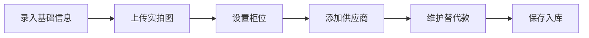
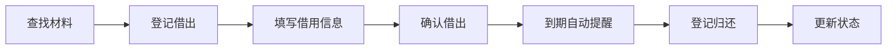
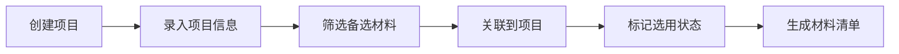

## 1. 产品概述
建筑设计团队内部材料样本管理桌面客户端，解决设计师在会议室、样品柜和项目文件之间频繁核对材料样本的效率问题。

- **核心目的**：系统化管理建筑材料样本的全生命周期，包括录入、借出、关联项目、状态追踪和统计分析
- **目标用户**：建筑设计师、项目负责人、材料管理员
- **核心价值**：提高会议决策效率、减少样本丢失、优化材料选用决策、规范样本管理流程

## 2. 核心特性

### 2.1 用户角色
| 角色 | 登记方式 | 核心权限 |
|------|----------|----------|
| 系统用户 | 本地账号登录 | 所有功能操作、数据管理 |

### 2.2 功能模块
1. **材料总览**：材料列表、多条件筛选、快速搜索、柜位检索
2. **样本详情**：材料信息维护、替代款管理、实拍图上传、沟通备注、供应商信息
3. **借出登记**：借用登记、归还管理、借用历史追踪
4. **项目关联**：项目管理、样本与项目方案关联、项目材料清单
5. **到期提醒**：逾期样本自动提醒、借用期限设置
6. **统计分析**：材料选用频次统计、项目材料汇总、数据分析图表

### 2.3 页面详情
| 页面名称 | 模块名称 | 功能描述 |
|---------|---------|----------|
| 材料总览 | 顶部搜索栏 | 支持按名称、品牌、规格快速搜索 |
| 材料总览 | 筛选面板 | 按材质、项目、供应商、状态多条件筛选 |
| 材料总览 | 材料列表 | 卡片式展示，显示缩略图、名称、品牌、柜位、状态 |
| 材料总览 | 快速操作 | 一键查看详情、登记借出、关联项目 |
| 样本详情 | 基础信息 | 材料名称、品牌、规格、颜色、材质、实拍图 |
| 样本详情 | 存放信息 | 柜位编号、库存数量、当前状态（正常/已停产/待补样/暂不推荐） |
| 样本详情 | 价格信息 | 单价区间、最小起订量、供应商报价 |
| 样本详情 | 替代款管理 | 同一材料的多个替代款维护，支持对比 |
| 样本详情 | 供应商信息 | 联系人、电话、邮箱、地址 |
| 样本详情 | 沟通备注 | 历史沟通记录追加、时间戳 |
| 借出登记 | 借用表单 | 借用人、借出时间、预计归还时间、借出用途 |
| 借出登记 | 借出列表 | 当前借出中、已归还、逾期未还分类展示 |
| 借出登记 | 归还操作 | 一键登记归还、损坏记录 |
| 项目关联 | 项目列表 | 所有项目概览，显示项目名称、阶段、负责人 |
| 项目关联 | 项目详情 | 项目基本信息、关联样本列表、方案版本 |
| 项目关联 | 关联操作 | 批量关联材料到项目、设置选用状态（备选/已选用/待确认） |
| 项目关联 | 清单导出 | 生成项目材料清单，支持导出 |
| 到期提醒 | 提醒列表 | 按逾期天数排序，显示借用人、材料名称、借出时间 |
| 到期提醒 | 提醒设置 | 自定义提醒阈值、批量通知 |
| 统计分析 | 选用频次 | 各类材料被选用频次统计，柱状图展示 |
| 统计分析 | 项目汇总 | 各项目材料使用数量、成本估算 |
| 统计分析 | 状态分布 | 样本状态占比饼图、借出状态统计 |
| 统计分析 | 供应商分析 | 供应商材料数量、价格区间对比 |

## 3. 核心流程

### 3.1 材料录入流程

### 3.2 样本借用流程

### 3.3 项目关联流程

## 4. 用户界面设计

### 4.1 设计风格
- **整体定位**：专业、稳重、高效的工业级工具风格，强调信息清晰度和操作便捷性
- **主色调**：深炭灰色（#1E293B）作为主背景，搭配工业蓝（#3B82F6）作为主交互色
- **辅助色**：
  - 状态-正常：翠绿色（#10B981）
  - 状态-待补样：琥珀色（#F59E0B）
  - 状态-已停产：玫瑰红色（#F43F5E）
  - 状态-暂不推荐：石板灰色（#64748B）
  - 状态-逾期：橙红色（#F97316）
- **字体**：
  - 标题："Noto Sans SC"，粗体，字重700
  - 正文："Noto Sans SC"，常规，字重400
  - 数据："JetBrains Mono"，用于编号、日期等数据展示
- **布局风格**：左侧固定导航栏 + 右侧内容区的经典桌面应用布局，信息密度适中
- **按钮样式**：矩形微圆角（4px），扁平化设计，hover状态有轻微阴影
- **图标风格**：线性图标，粗细2px，简洁专业，使用Heroicons

### 4.2 页面设计概述
| 页面名称 | 模块名称 | UI元素 |
|---------|---------|--------|
| 材料总览 | 整体布局 | 顶部搜索+筛选区，下方网格列表，卡片间距16px |
| 材料总览 | 材料卡片 | 左图右文，图片120x120，右侧显示名称、品牌、柜位标签、状态标签 |
| 样本详情 | 整体布局 | 左右分栏，左侧图片区（可切换多图），右侧信息区（Tab切换） |
| 样本详情 | Tab导航 | 基础信息、替代款、供应商、备注历史 |
| 借出登记 | 列表布局 | 三栏Tab：借出中、已归还、逾期，表格展示 |
| 项目关联 | 项目卡片 | 显示项目名称、阶段标签、负责人、关联材料数量 |
| 到期提醒 | 提醒列表 | 按紧急程度排序，逾期标红，高亮显示逾期天数 |
| 统计分析 | 图表区 | 顶部卡片展示关键指标，下方图表区2列布局 |

### 4.3 响应式
- **桌面优先**：最小宽度1280px，最佳体验1920px
- **触控优化**：按钮最小尺寸32x32px，支持平板触控操作
- **窗口适配**：内容区支持滚动，导航栏固定宽度240px

### 4.4 交互细节
- 页面切换：淡入淡出过渡，时长200ms
- 卡片hover：上移2px，阴影加深
- 表单输入：聚焦时边框高亮为主交互色
- 状态标签：背景色+文字色组合，不使用纯图标
- 加载状态：骨架屏占位，避免布局跳动
