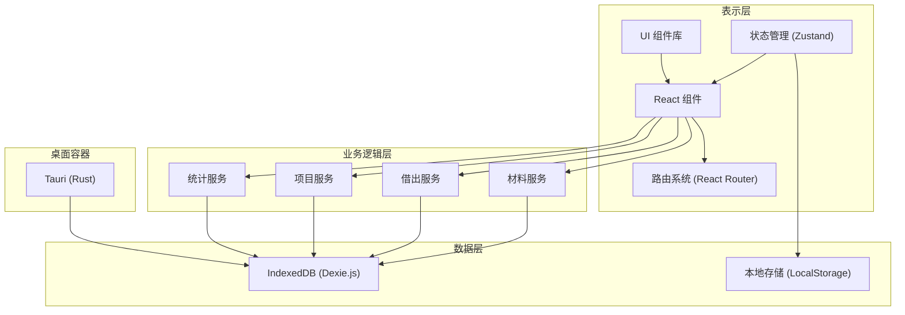
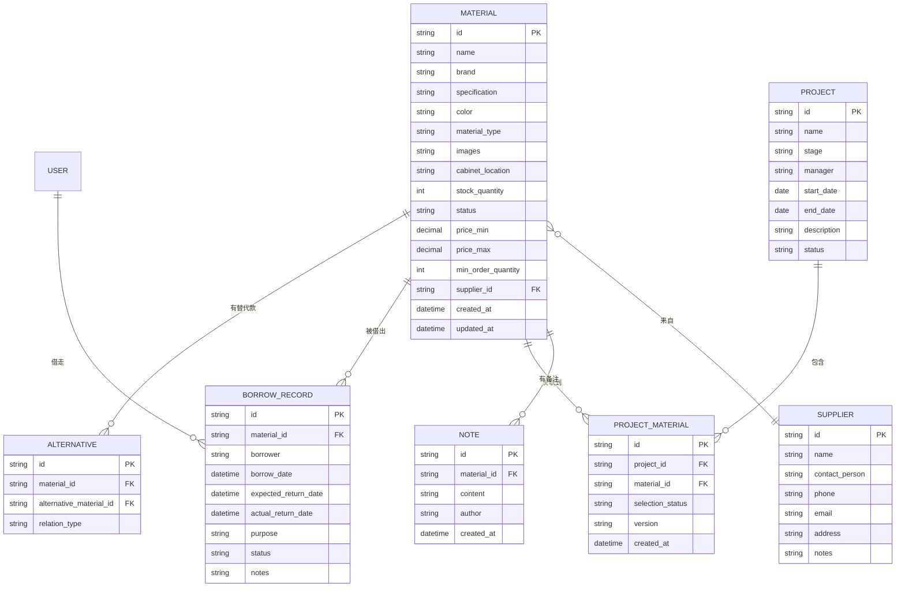

## 1. 架构设计



## 2. 技术描述

- **前端框架**：React 18 + TypeScript 5
- **构建工具**：Vite 5
- **状态管理**：Zustand 4（轻量级，适合桌面应用）
- **UI 组件库**：TailwindCSS 3 + Headless UI + Heroicons
- **本地数据库**：IndexedDB + Dexie.js 3
- **图表库**：Recharts 2
- **桌面容器**：Tauri 2（Rust + Webview2，相比Electron更轻量）
- **路由**：React Router 6
- **数据存储**：本地 IndexedDB 持久化，无需后端服务
- **图片存储**：Base64 编码存储在 IndexedDB，或本地文件路径引用

## 3. 路由定义

| 路由 | 用途 |
|------|------|
| /materials | 材料总览 - 材料列表、筛选、搜索 |
| /materials/:id | 样本详情 - 单个材料的详细信息 |
| /materials/new | 新增材料 - 材料录入表单 |
| /borrow | 借出登记 - 借用管理、归还登记 |
| /projects | 项目关联 - 项目列表、材料关联 |
| /projects/:id | 项目详情 - 单个项目的材料清单 |
| /reminders | 到期提醒 - 逾期样本提醒列表 |
| /analytics | 统计分析 - 数据统计、图表展示 |

## 4. 数据模型

### 4.1 ER 图



### 4.2 TypeScript 类型定义

```typescript
// 材料状态
type MaterialStatus = 'normal' | 'discontinued' | 'need_restock' | 'not_recommended';

// 借出状态
type BorrowStatus = 'borrowed' | 'returned' | 'overdue';

// 项目阶段
type ProjectStage = 'concept' | 'scheme' | 'design' | 'construction' | 'completed';

// 选用状态
type SelectionStatus = 'alternative' | 'selected' | 'pending';

interface Material {
  id: string;
  name: string;
  brand: string;
  specification: string;
  color: string;
  materialType: string;
  images: string[];
  cabinetLocation: string;
  stockQuantity: number;
  status: MaterialStatus;
  priceMin: number;
  priceMax: number;
  minOrderQuantity: number;
  supplierId: string;
  createdAt: Date;
  updatedAt: Date;
}

interface Supplier {
  id: string;
  name: string;
  contactPerson: string;
  phone: string;
  email: string;
  address: string;
  notes: string;
}

interface BorrowRecord {
  id: string;
  materialId: string;
  borrower: string;
  borrowDate: Date;
  expectedReturnDate: Date;
  actualReturnDate?: Date;
  purpose: string;
  status: BorrowStatus;
  notes?: string;
}

interface Project {
  id: string;
  name: string;
  stage: ProjectStage;
  manager: string;
  startDate: Date;
  endDate?: Date;
  description: string;
  status: 'active' | 'completed' | 'on_hold';
}

interface ProjectMaterial {
  id: string;
  projectId: string;
  materialId: string;
  selectionStatus: SelectionStatus;
  version: string;
  createdAt: Date;
}

interface Note {
  id: string;
  materialId: string;
  content: string;
  author: string;
  createdAt: Date;
}

interface Alternative {
  id: string;
  materialId: string;
  alternativeMaterialId: string;
  relationType: 'replacement' | 'upgrade' | 'similar';
}
```

### 4.3 数据库初始化脚本

```typescript
// Dexie.js 数据库定义
import Dexie, { Table } from 'dexie';

export class MaterialDatabase extends Dexie {
  materials!: Table<Material>;
  suppliers!: Table<Supplier>;
  borrowRecords!: Table<BorrowRecord>;
  projects!: Table<Project>;
  projectMaterials!: Table<ProjectMaterial>;
  notes!: Table<Note>;
  alternatives!: Table<Alternative>;

  constructor() {
    super('MaterialDB');
    
    this.version(1).stores({
      materials: 'id, name, brand, materialType, status, supplierId, cabinetLocation',
      suppliers: 'id, name',
      borrowRecords: 'id, materialId, borrower, status, borrowDate, expectedReturnDate',
      projects: 'id, name, status, manager',
      projectMaterials: 'id, projectId, materialId, selectionStatus',
      notes: 'id, materialId, createdAt',
      alternatives: 'id, materialId, alternativeMaterialId'
    });
  }
}

export const db = new MaterialDatabase();
```

## 5. 目录结构

```
src/
├── components/          # 公共组件
│   ├── Layout/         # 布局组件
│   ├── MaterialCard/   # 材料卡片
│   ├── StatusBadge/    # 状态标签
│   ├── SearchBar/      # 搜索栏
│   └── FilterPanel/    # 筛选面板
├── views/              # 页面视图
│   ├── Materials/      # 材料总览
│   ├── MaterialDetail/ # 样本详情
│   ├── Borrow/         # 借出登记
│   ├── Projects/       # 项目关联
│   ├── Reminders/      # 到期提醒
│   └── Analytics/      # 统计分析
├── store/              # 状态管理
│   ├── useMaterialStore.ts
│   ├── useBorrowStore.ts
│   ├── useProjectStore.ts
│   └── useUIStore.ts
├── services/           # 业务服务
│   ├── materialService.ts
│   ├── borrowService.ts
│   ├── projectService.ts
│   └── analyticsService.ts
├── db/                 # 数据库
│   ├── index.ts
│   └── seed.ts         # 初始化数据
├── types/              # 类型定义
│   └── index.ts
├── utils/              # 工具函数
│   ├── format.ts
│   ├── date.ts
│   └── file.ts
├── App.tsx
├── main.tsx
└── index.css
```

## 6. 核心功能实现要点

### 6.1 多条件筛选
使用组合筛选函数，支持材质、项目、供应商、状态的多条件AND/OR组合查询，结果实时更新。

### 6.2 逾期自动检测
应用启动时和定时（每小时）检查所有借出记录，将超过预计归还日期的记录标记为逾期，并更新提醒列表。

### 6.3 图片上传处理
支持多图上传，使用Canvas压缩后转为Base64存储在IndexedDB，避免依赖外部文件系统。

### 6.4 数据导出
项目材料清单支持导出为CSV格式，使用Blob API在前端生成，无需后端。

### 6.5 性能优化
- 使用React.memo优化列表渲染
- 图片懒加载
- 数据库查询使用索引
- 大数据量时使用虚拟滚动
